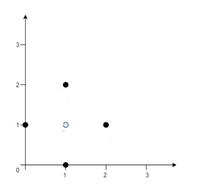
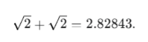

## Question 1 
### a) Optimizing Sensor Placement for Data Collection [5 Marks]
#### Problem: Optimal Sensor Placement for Signal Strength 
 A research team is deploying a network of static environmental sensors across a remote area. Each sensor is located at a known geographical coordinate on a 2D plane. To maximize the efficiency of data collection and minimize signal attenuation, the team wants to establish a central data aggregation hub. The ideal location for this hub is one that minimizes the total sum of the Euclidean distances to all deployed sensors, as signal strength degrades with distance. 
 
 Given an array sensor_locations where sensor_locations[i] = [xi, yi] represents the coordinates of the i-th environmental sensor on the map, return the minimum total sum of the Euclidean distances from the data aggregation hub to all sensors. 
 
 In other words, you need to choose the optimal position for the data aggregation hub [hub_x, hub_y] such that the following formula is minimized: 
 

 
 

#### Example 1: 

 
Input: sensor_locations = [[0,1],[1,0],[1,2],[2,1]] 

Output: 4.00000 

Explanation: Placing the hub at [hub_x, hub_y] = [1, 1] results in a distance of 1 to each sensor. The sum of 
all distances is 4, which is the minimum achievable. 

#### Example 2:

 
Input: sensor_locations = [[1,1],[3,3]] 

Output: 2.82843 

Explanation: The minimum possible sum of distances is 

### solution
#### understanding the problem
This is known as the **Geometric Median** problem. It is also frequently called the **Fermat-Weber Problem**.

In the world of competitive programming (like LeetCode), you can find this exact problem under the title **"[Best Position for a Service Centre.](https://leetcode.com/problems/best-position-for-a-service-centre/description/) "** <-- click to see the exact problem
 

-------

### b) The Traveling Salesperson Problem (TSP) - Classic Application [5 Marks]
Problem: You are a logistics manager for a delivery company, and you have a list of N customer locations 
(cities) you need to visit, starting and ending at your depot. Your goal is to find the shortest possible route 
that visits each customer exactly once. 
 
#### Task: 
1. Generate a TSP Instance: Create a set of N cities (e.g., N=20 to 50 for manageable computation) 
with random 2D coordinates (e.g., between 0 and 1000). The "distance" between any two cities is 
their Euclidean distance. 
2. Implement Simulated Annealing: Apply the Simulated Annealing algorithm to find a near-optimal 
solution to this TSP instance. 

    - State: A permutation of cities representing a tour. 
    -  Objective Function: Total Euclidean distance of the tour. 

    - Neighborhood: Common neighborhood operations for TSP include: 
        - 2-opt: Reverse a segment of the tour (e.g., A-B-C-D-E to A-B-D-C-E). 
        - Swap: Swap two random cities in the tour. 

    -  Cooling Schedule: Experiment with at least two different cooling schedules (e.g., 
exponential T = T_initial * alpha^k vs. linear T = T_initial - beta * k). 

    -  Stopping Criteria: Max iterations, or temperature falling below a threshold. 
 

