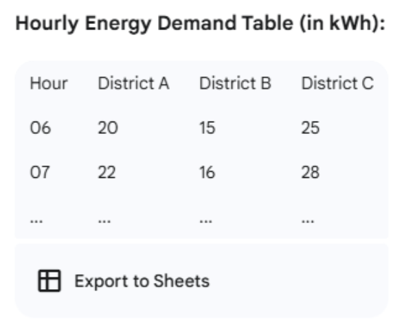
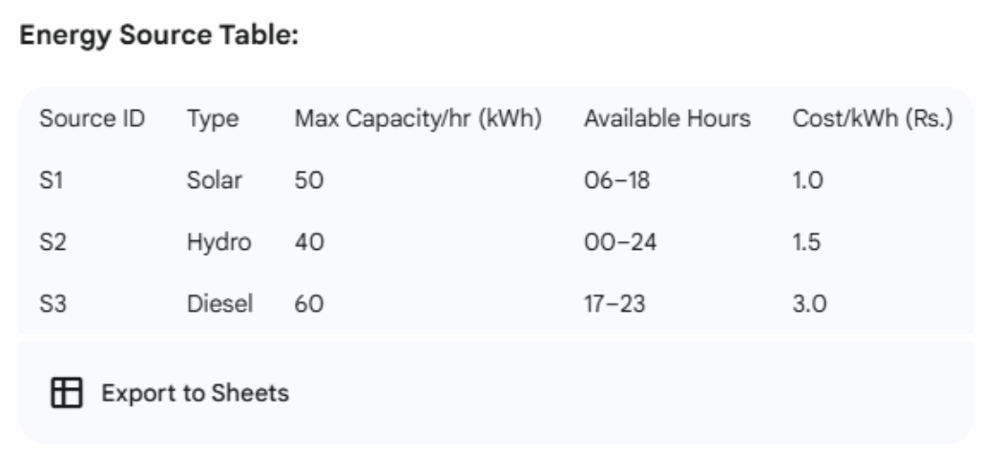
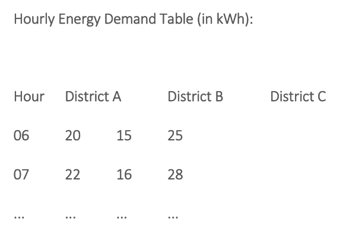
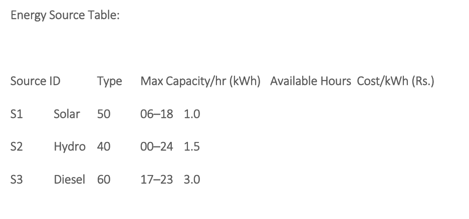
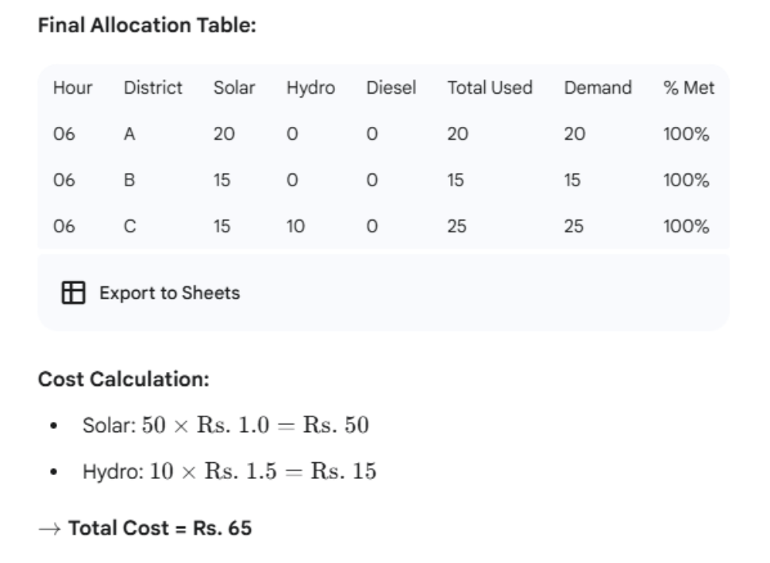

## Question 4: Smart Energy Grid Load Distribution Optimization (Nepal) [20 Marks]
In a progressive move towards sustainable energy usage, a city in Nepal has implemented a smart grid. This 
system dynamically allocates energy from various sources—solar, hydro, and diesel generators—to meet 
the power demands of its districts on an hourly basis. 
As a systems engineer, your task is to develop a load balancing algorithm using advanced techniques like 
Dynamic Programming and Greedy Strategy. The goal is to optimally distribute energy to each district for 
every hour of the day
### inputs

Here's a rephrased version of the smart energy grid scenario, with costs expressed in Nepali Rupees (Rs.):

## Real-World Context: Smart Energy Grid Load Distribution Optimization (Nepal) 
In a progressive move towards sustainable energy usage, a city in Nepal has implemented a smart grid. This 
system dynamically allocates energy from various sources—solar, hydro, and diesel generators—to meet 
the power demands of its districts on an hourly basis.

 
As a systems engineer, your task is to develop a load balancing algorithm using advanced techniques like 
Dynamic Programming and Greedy Strategy. The goal is to optimally distribute energy to each district for 
every hour of the day.

### inputs

### Constraints
- Each district's demand must be met within ±10%. 
 
- Each energy source has limited capacity and specific hours of availability.  
- The objective is to minimize total cost and reduce diesel usage. 

### Tasks (Marks total — distributed per task)
#### Model the Input Data (2 marks)
- Prepare or load the demand and source tables in your code using arrays or from JSON/CSV files. 
#### Design an Hourly Allocation Algorithm (5 marks) 
- Using Dynamic Programming, model each hour’s assignment to fulfill all district demands by checking different combinations of energy sources under capacity and time constraints. 
#### Implement Greedy Source Prioritization (3 marks) 
- Within each hour, implement a greedy approach to always choose the cheapest available sources first before using costly sources like diesel. 
#### Handle Approximate Demand Satisfaction (3 marks) 
- Incorporate logic to allow for ±10% flexibility if an exact match of demand is not possible within 
source limits. 
#### Output Table of Results (3 marks) 
- Display results for each hour and district, showing energy drawn from each source, total used, actual demand, and % fulfilled. 
#### Analyze Cost and Resource Usage (4 marks)

#### Report: 
Total cost of distribution.

% of energy fulfilled by renewable sources. 

Which hours/districts used diesel, and why. 

Comment briefly on your algorithm’s efficiency and trade-offs. 

## Sample Descriptive Calculation (for Hour 06)
### Demand: 
District A: 20 kWh

District B: 15 kWh

District C: 25 kWh

→ Total Demand = 60 kWh

### Available Sources at Hour 06: 
Solar: 50 kWh (Available, Cost = Rs. 1.0)

Hydro: 40 kWh (Available, Cost = Rs. 1.5)

Diesel: Not available at 06

### Step-by-step Allocation (Greedy by Cheapest): 
#### Start with Solar (50 kWh): 
##### Allocate: 
District A: 20 kWh (fully met)

District B: 15 kWh (fully met)

District C: 15 kWh (partial)

→ Total used from Solar = 20 + 15 + 15 = 50 kWh

→ Remaining for District C = 25 – 15 = 10 kWh 
#### Next use Hydro (max 40 kWh available): 
 
District C: 10 kWh (remaining demand fully met)

→ Total used from Hydro = 10 kWh

