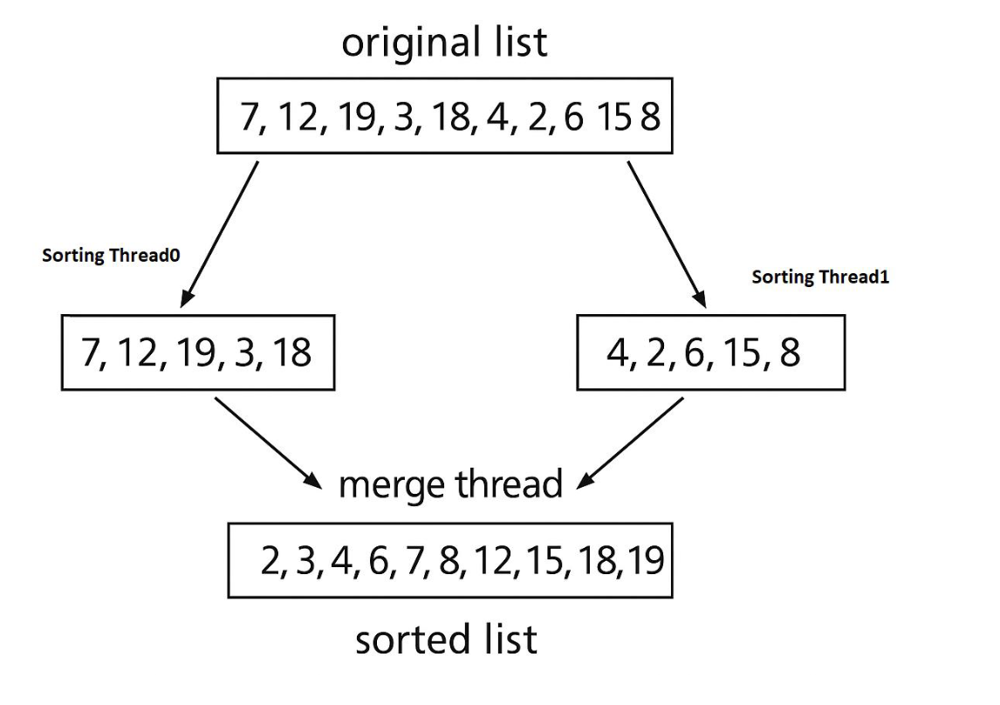

# Question 5: 

## a) Advanced Algorithm Design with GUI Integration [20 Marks] 

### Project Title: Interactive Emergency Network Simulator
#### Scenario Overview: 
You are tasked with building an interactive GUI-based tool for simulating and optimizing 
a national Emergency Communication & Response System. The tool must allow users (e.g., planners, 
analysts) to visualize and interact with a dynamic graph-based network and a tree-based command 
structure, applying advanced algorithmic techniques to solve real-time problems. 

### System Requirements:
- A graphical interface that allows: 
- Drawing cities (nodes) and roads (edges) with weights. 
- Highlighting critical hubs and supply centers. 
- Visualizing communication paths and failures. 
- A command hierarchy viewer using tree structures to show organizational flow. 
- User inputs to simulate failures, add/remove roads, and trigger algorithmic analysis.

### Tasks
#### Q1. Dynamic MST Visualization [6 marks]
- Implement an interactive feature where the user can: 
- Click to generate and display the Minimum Spanning Tree connecting all supply centers and critical 
hubs. 
- View updated MST when new edges or nodes are added. 
- Show screenshots and explain the backend logic (e.g., Kruskal’s or Prim’s algorithm and time 
complexity).

#### Q2. Reliable Path Finder with GUI Controls [5 marks]

- Create a visual control panel for: 
- Selecting any two nodes. 
- Displaying K most reliable disjoint paths between them, avoiding marked “vulnerable roads”. 
- Describe how your algorithm integrates with the GUI and how users interact with it. 
#### Q3. Command Hierarchy Optimizer [4 marks] 
- Allow users to: 
- View the current binary command tree. 
- Click “Optimize” to rebalance the tree and minimize the longest communication path from HQ. 
- Include visual before/after trees and explain the rebalancing algorithm. 
#### Q4. Failure Simulation & Rerouting Module [5 marks] 
- Build a simulation panel where: 
- Users can disable a node (simulate failure). 
- Automatically visualize: 
- Nodes affected (disconnected). 
- Recomputed shortest paths. 
- Increase in delivery/communication time. 
- Support your implementation with a GUI screenshot and logic explanation. 
#### Bonus Task [+2 Marks]: 
- Add a Graph Coloring visualizer for assigning frequencies to hubs such that no adjacent hubs use 
the same channel. 
- Optional, creative implementation. 

---

## (b) Multithreaded Sorting Application [10 Marks]
Write a multithreaded sorting program that works as follows: A list of integers is divided into two smaller 
lists of equal size. Two separate threads (which we will term sorting threads) sort each sublist using a 
sorting algorithm of your choice. The two sublists are then merged by a third thread—a merging thread—
which merges the two sublists into a single sorted list. Because global data are shared across all threads, 
perhaps the easiest way to set up the data is to create a global array. Each sorting thread will work on one 
half of this array. A second global array of the same size as the unsorted integer array will also be 
established. The merging thread will then merge the two sublists into this second array. Graphically, this 
program is structured as in Figure Below.

This programming task will require passing parameters to each of the sorting threads. In particular, it will be 
necessary to identify the starting index from which each thread is to begin sorting. The parent thread will 
output the sorted array once all sorting threads have exited.

