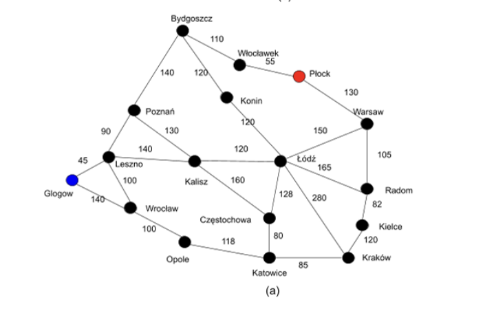
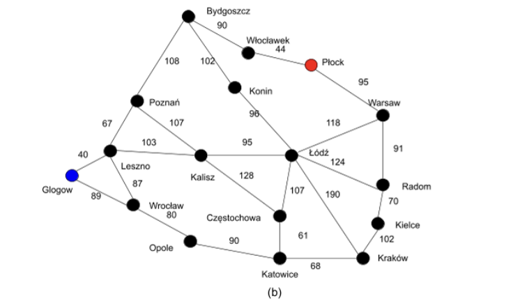

# Question 6: Robot Navigation Using Search Algorithms [30 Marks]
## Problem description
### Diagram (a) 
Below contains a simplified network mapping the geographical locations and distances 
between cities in Poland. There is a robot that can help to deliver parcels. Now, suppose you are 
developing an algorithm for this robot to achieve this task. The node highlighted in blue is your starting 
city, and the node in red is the goal city.

### Diagram (b)
Below contains the straight-line distances between two cities.

## Assessment Requirements 
### 1. Based on the provided diagram map (a), build the state space (5 Marks).   
-  a. Solve the above problem using a depth-first-search (DFS) algorithm. Use open and closed containers to explain the algorithm. (5 Marks)   
-  b. Solve the above problem using a breadth-first-search (BFS) algorithm. Use open and close containers to explain the algorithm. (5 Marks)   
### 2. Based on the provided diagram map (b), design the heuristic function (10 marks).  Solve the above problem using the A* algorithm.  
### 3. Discuss the advantages and disadvantages of BFS, DFS and A* search algorithms using the problem you analysed and the resulting solutions/paths as the context for your discussion (5 Marks) 
